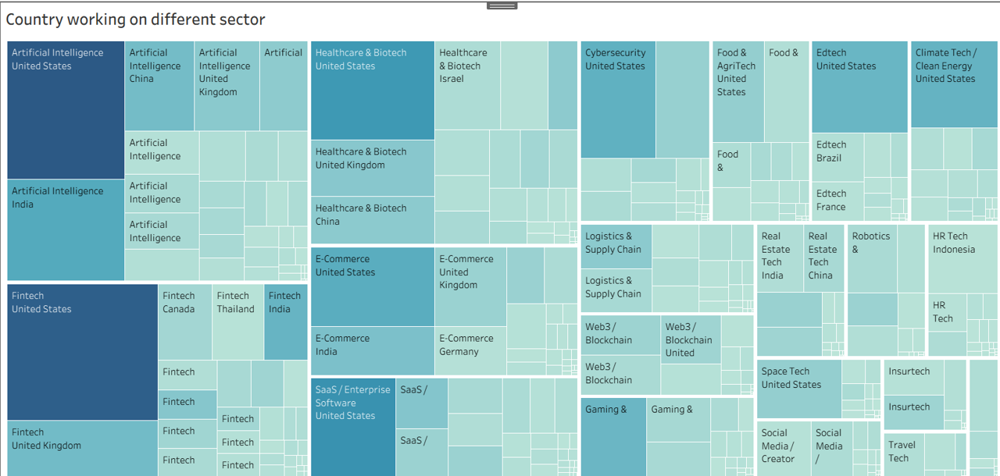
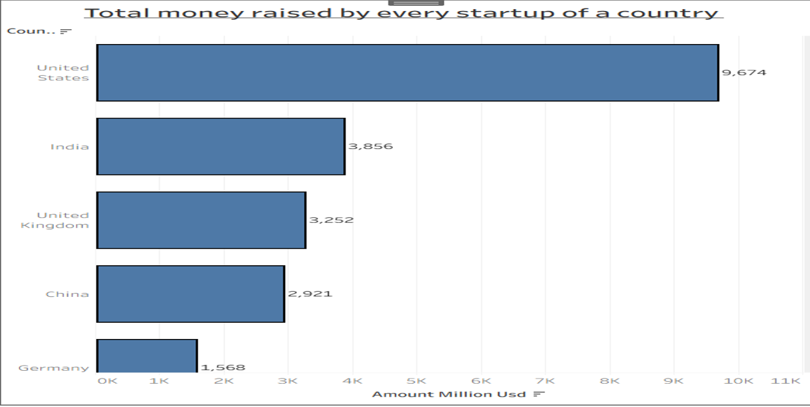
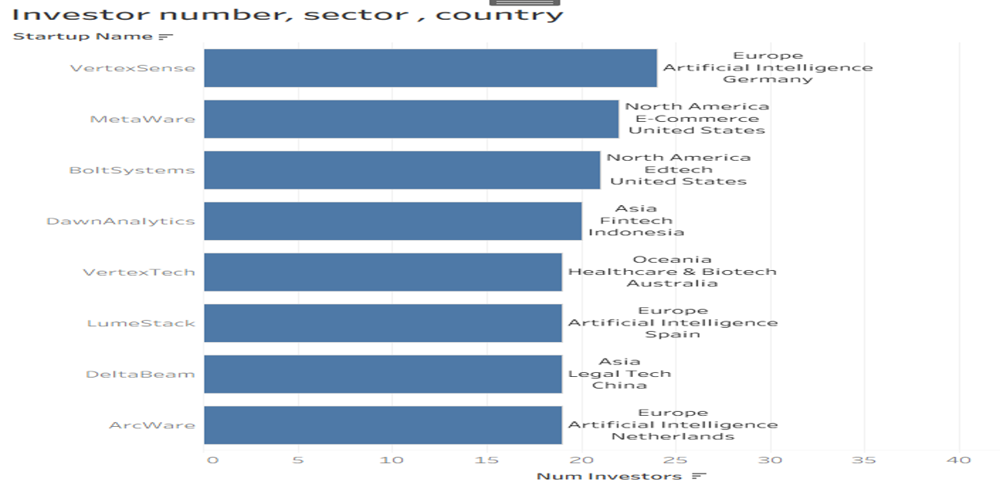

# Global Startup Ecosystem Analysis

## Project Overview
This project provides a comprehensive data-driven evaluation of the global startup ecosystem. By analyzing funding trends, geographic distributions, and sector-specific performance, this case study uncovers actionable insights for investors and stakeholders.

## Business Problem
Venture capital firms and startup founders need a data-driven evaluation of the global startup ecosystem to identify high-performing geographic markets, thriving industry sectors, and key investment drivers. This analysis addresses the lack of visibility into capital concentration and regional performance disparities.

## Data Source & License
- **Data Source:** The raw dataset used for this project was taken from **Kaggle**.
- **Data Reliability & ROCC Framework:** The dataset fulfills the ROCC framework criteria (Reliable, Original, Comprehensive, Current, and Cited).
- **License:** Released under the **CC0: Public Domain** license, permitting free use, modification, and distribution for research and portfolio development.

## Methodology
- **Data Preparation:** Cleaned and processed multi-table relational datasets (`startups.csv`, `funding_rounds.csv`, `investors.csv`, `quarterly_summary.csv`).
- **Data Analysis:** Performed complex SQL joins, aggregations (`COUNT`, `MAX`), grouping, and sorting using PostgreSQL and DBeaver.
- **Data Visualization:** Developed interactive Tableau dashboards to map regional performance, sector diversity, and capital inflow.

## Key Findings
- **Regional Dominance:** The United States leads globally in capital accumulation, investor engagement, and sector diversity.
- **Performance Extremes:** Significant disparities exist between top-tier hubs (US) and emerging markets (Bangladesh), indicating the need for localized research.
- **Top Performers:** Identified high-valuation outliers like CruxWare (peaking at $2,405.16 million USD post-money valuation), setting benchmarks for market capitalization.

## Visualizations

### 1. Geographic Funding Distribution

### 2. Sector Diversity Treemap

### 3. Investor & Sector Breakdown

## Recommendations
1. **Prioritize High-Value Markets:** Focus core venture capital and expansion resources on established, high-performing hubs like the United States.
2. **Conduct Localized Research:** Initiate qualitative local surveys and discovery initiatives in underrepresented regions (such as Bangladesh) to identify niche opportunities.
3. **Strategic Diversification:** Balance investment portfolios across established high-growth sectors and emerging regional domains.

## Tools & Technologies
- **SQL (PostgreSQL / DBeaver):** Data querying, relational table joins, and aggregation.
- **Tableau:** Visual storytelling, interactive filtering, and dashboard design.
- **Excel:** Initial data exploration and cleaning workflows.

---
*Created by Sidhant Negi*
